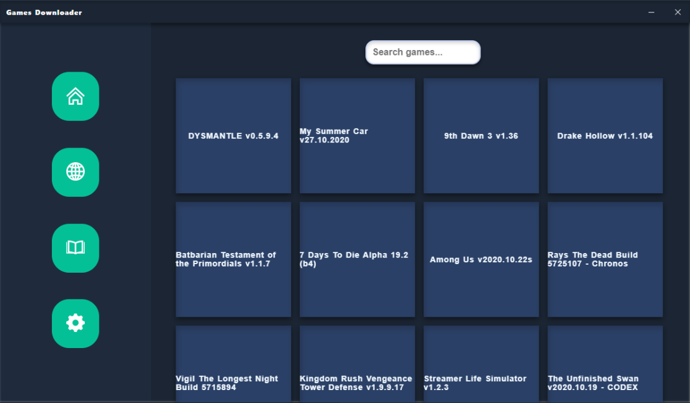
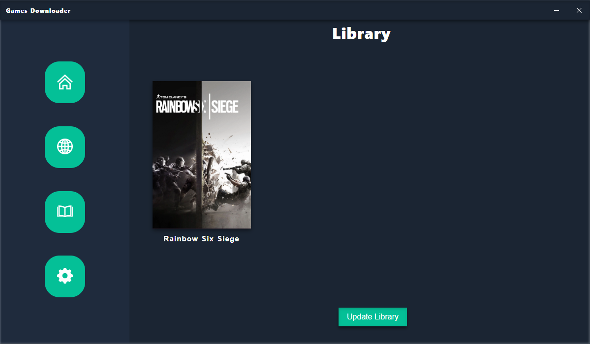

# Games Downloader
  

  

    

    

This app aims to download the game of your choice, and see installed games in the library panel.
The games list is not public, as for the script that makes it; if you want it, contact me.
Each game has a respective panel wich display the size, info on installations and a download button; the download button download the torrent file of the game.
  
 
   
## This project is for demonstration purposes only.
   Developers have no responsibility for any use of this software.

What works:
   - Read list of the games with info and download of each game.
   - Start installed games in Library.

What is missing?
   - Make the update library button work.
   - Implement scraping of CrackWatch website to see the latest cracked games.
   
   
   
   
   
  
## This project is licensed under the GNU GPL V3.0

Are accepted all types of contributes.
If you want to contribute to the code just make a pull request.

